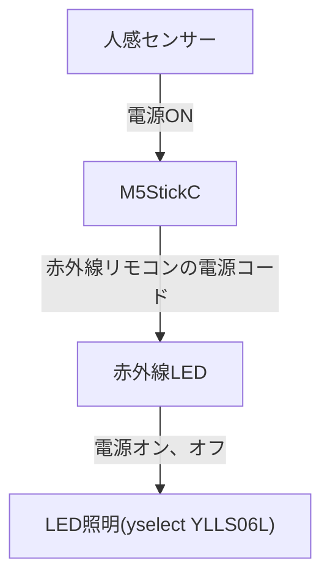

## はじめに

セカンドセレクションの前野です。
今回はM5StickCを使って、LED照明を点灯させるスマートホームに挑戦です。

出来上がりのところだけでは面白くないから、紆余曲折したところも書きましたのでよろしくね。

最終的なハード構成とデータの流れは下記のようになります。




## キッカケ

### 部屋が暗い

昔の蛍光灯の蛍光灯照明を使っているけど近年とみに暗く感じるようになりました。机の前にはサブのLED電球をつけていますが、部屋全体が暗いということで6畳用LED照明を付けることとなりました。

前のLED照明は紐で引っ張ってつけるプルスイッチだったんですが、今回のはリモコンでオンオフするようになりました。

### リモコンは面倒くさい

部屋に入ってリモコンを探して、小さなボタンを押す。面倒くさがりの私にとってはイラッと来てしまいます。それに部屋は、モノで溢れているのでリモコンが行方不明になるのも時間の問題でした。

何とかしたいということで、勝手にLED照明をつけてくれる赤外線リモコンを作ろうと思い立ちました。

以前、テレビとかビデオ操作用に赤外線LEDや赤外線センサーなどを買ってあったので、これでなんとかなるだろう。いろいろ試行錯誤したところも書けば、記事が1本書けると一石二鳥です。

## 今回使った部品

| 部品                        | 説明                                                         | URL                                                          |
| --------------------------- | ------------------------------------------------------------ | ------------------------------------------------------------ |
| LED照明                     | YAMADA電気 YLLS06L                                           | https://www.yamada-denkiweb.com/2895583019/                  |
| 赤外線LED                   | φ5mm スーパーデラックス パワー赤外線LED (Ir-LED) 940nm       | https://eleshop.jp/shop/g/gI9E319/                           |
| M5StickC                    | M5StickC                                                     | https://www.switch-science.com/products/6350                 |
| M5Stack用ミニプロトユニット | 赤外線LEDの回路を組み込みます。M5StackCからGROVEケーブル経由で接続します。 | https://www.switch-science.com/products/6557?_pos=9&_sid=717a11579&_ss=r |
| 人感センサー                | 人感センサーケーブル(WH)                                 | https://jpbulk.daisonet.com/products/4550480403083           |


## 試したこと

- リモコンの赤外線コードを取得
- M5StickCで動かしてみよう
- LED照明の赤外線センサーはどこだ
- 赤外線LEDについて調べる
- M5StickCに赤外線LEDを外付けしました
- 人感センサーについて

### リモコンの赤外線コードを取得

これがわからないとLED照明を点けられません。LED照明のリモコンが赤外線LEDを光らせているコードのことです。

幸いな事に赤外線リモコンセンターを作った時にコード読み取り装置も一緒に作ったのでそれを使いました。

#### LED照明(製品名：YAMADA電気 YLLS06L）

ヤマダ電機で安かったので購入しました。

プロトコルはNEC、32 Bitでした。

| ボタン名              | コード       |
| --------------------- | ------------ |
| 電源                  | `0x59A220DF` |
| 全灯（LED照明を灯す） | `0x59A212ED` |


### M5StickCで動かしてみよう

とりあえず赤外線LED,電池がついてて便利なM5StickCで動かしてみました。

おお動いた。まあ当たり前だけど。

このままM5StickCで出来ればと思ったのですが、ここで問題発生です。

M5StickCの赤外線LEDの出力がヘボすぎるため消灯から点灯はできるんだが、点灯から消灯の時はM5StickCをLED照明に近づけないと反応してくれません。

### LED照明の赤外線センサーはどこだ

LED照明の蓋を外して探してみましたが、どこにあるのかがわかりません。マニュアルを見ると円状に並んでるLEDの内側にありました。これではLED照明の光に邪魔されて赤外線LEDの根性がなければ無理だ。

### 赤外線LEDについて調べる

ここで赤外線LEDについて勉強しました。

https://qiita.com/oouaioi/items/8daaadc69330c3d2eb52

光の出力はmW/srで表すんだ。これが大きければ赤外線の出力は上がっていきます。
あと、通販のすごい高出力の赤外線LEDには心惹かれましたが、そこまでいらんやろうということで、ポチるのはやめました。

M5StickCの赤外線LEDの諸元を調べてみましたが、わかりませんでした。電池の容量の関係もあって、赤外線が出ますよレベルですね。


### M5StickCに赤外線LEDを外付けしました

赤外線LEDは、VF 1.6V 100mA 60mWをチョイスしました。(共立電子で購入)

赤外線LEDの回路は、GPIO32のオープンドレインで赤外線LEDをドライブする簡単なモノです。やっぱりトランジスタか、FETを使ったほうがいいでしょうか。

間違っていたらコメントで教えてください。


### 人感センサーについて

どうやって人を感知するのか。

DAISOで人感センサーが売ってました。恐るべしDAISO。

この人感センサーは、人を感知するとメスUSBで電力を供給する優れモノ。部品屋で人感センサーを買ったら1000円超えるから300円なんて安いもんです。

スイッチオンしてから1分ぐらいでオフになります。

(あの後もう1台欲しいので買いに行ったらどこでも売っていませんでした。まいった(\*_\*))

M5StickC→人感センサー→ACアダプタで繋いでハードウェアは完了です。

レッツプログラミング‼。

## ソース

相変わらずPlatformIOで書いています。クラス名を書いたらメソッドを補完してくれるし、ライブラリの関数のソースまで飛んでくれるし、一番いいのはプロジェクトごとにボードを指定できるとこがいいです。

1. 人感センサーが人を感知したらM5StickCの電源が流れるので、M5StickCはオンになります。
1. 起動したM5StickCは全灯の信号を赤外線LEDでLED照明へ送ります。
1. 電源がオンの間は、M5StickCのLEDを点滅します。
1. 人感センサーがオフになったら、M5StickCは60秒後に電源オンオフのリモコンコードをLED照明へ送ります。
1. M5StickCの電源をオフにします。

ボタンを押下した時の処理も追加しています。

- Aボタンを押したらLED照明がオン・オフします。

- Bボタンを押したらM5StickCの電源をオフにします。


```cpp
#include <M5StickC.h>
#include <IRremoteESP8266.h>
#include <IRsend.h>
#include <IRutils.h>

const uint16_t SEND_PIN = GPIO_NUM_32; // 赤外線LEDのピンを取得

IRsend irsend(SEND_PIN); // 送信オブジェクト

bool success = true;
decode_type_t protocol = NEC;
uint16_t size = 32;
const uint16_t heder = 0x59A2;

// リモコンコード保存用構造体
struct REMOTE
{
    char name[9];
    uint16_t command;
};

#define CMD_POERONOFF 0
#define CMD_LIGHT 1

// リモコンコード一覧
REMOTE remote[] = {
    {"POWER", 0x20df},
    {"ALLLIGHT", 0x12ED}};
int count;
int poweroffcount;

bool usbFlag = false;
bool runnnig;
int ledcount;
bool ledflag;
bool autoflag;
int led_blink_cout;

void sendcmd(int index)
{
    uint64_t send = 0;
    send = (uint64_t)(heder << 16);
    send += (uint64_t)(remote[index].command);
    irsend.sendNEC(send); // 送信
    ledflag = false;
}

void setup()
{
    M5.begin();     // M5StickC初期化
    irsend.begin(); // IR初期化
    Serial.begin(115200);
    Serial.println("Start");
    // リモコン項目表示
    M5.Lcd.fillScreen(BLACK);

    autoflag = true;
    poweroffcount = -1;
    count = 0;
    led_blink_cout = 5;

    Serial.println("sendcmd");
    sendcmd(CMD_LIGHT);

    pinMode(SEND_PIN, OUTPUT_OPEN_DRAIN);
    digitalWrite(SEND_PIN, HIGH);

    pinMode(GPIO_NUM_10, OUTPUT);
    digitalWrite(GPIO_NUM_10, HIGH);
}
void loop()
{
    M5.update(); // ボタン状態更新
    if (M5.Axp.GetVBusCurrent() >= 1.0)
    {
        usbFlag = true;
    }
    else
    {
        usbFlag = false;
    }
    // M5ボタン
    if (M5.BtnA.wasPressed())
    {
        Serial.println("M5.BtnA.wasPressed");
        sendcmd(CMD_POERONOFF);
        // M5.Axp.PowerOff();
        autoflag = false;
        return;
    }
    // 右ボタン
    if (M5.BtnB.wasPressed())
    {
        Serial.println("M5.BtnB.wasPressed");
        // sendcmd(CMD_LIGHT);
        M5.Axp.PowerOff();
        return;
    }
    if (autoflag)
    {

        if (!usbFlag)
        {
            if (poweroffcount == -1)
            {
                poweroffcount = 600;
            }
            else if (poweroffcount == 0)
            {
                sendcmd(CMD_POERONOFF);
                M5.Axp.PowerOff();
            }
            poweroffcount -= 1;
            if (led_blink_cout < 0)
            {
                ledflag ^= 1;
                digitalWrite(GPIO_NUM_10, ledflag);
                led_blink_cout = 3;
            }
            else
                led_blink_cout -= 1;
        }
        else
        {
            if (led_blink_cout < 0)
            {
                ledflag ^= 1;
                digitalWrite(GPIO_NUM_10, ledflag);
                led_blink_cout = 5;
            }
            else
                led_blink_cout -= 1;
        }
    }
    else
    {
        digitalWrite(GPIO_NUM_10, HIGH);
    }

    if ((count % 10) == 0)
    {
        M5.Lcd.fillScreen(BLACK);
        M5.Lcd.setCursor(0, 8, 2);
        if (usbFlag)
        {
            M5.Lcd.setTextColor(GREEN);
            M5.Lcd.println("USB ON");
        }
        else
        {
            M5.Lcd.setTextColor(RED);
            M5.Lcd.println("Battery");
        }
        if (autoflag)
        {
            M5.Lcd.setTextColor(RED);
            M5.Lcd.println("Auto ON ");
            M5.Lcd.print(" Count:");
            M5.Lcd.print(poweroffcount);
        }
        else
        {
            M5.Lcd.setTextColor(BLUE);
            M5.Lcd.println("Auto OFF");
        }
        M5.Lcd.setTextColor(WHITE);
        M5.Lcd.setCursor(0, 64, 1);
        M5.Lcd.printf("Battery\n");
        M5.Lcd.printf(" Warn :%6d\n", M5.Axp.GetWarningLevel());   // バッテリー残量警告 0:残あり, 1:残なし
        M5.Lcd.printf(" Temp :%6.1f\n", M5.Axp.GetTempInAXP192()); // AXP192の内部温度
        M5.Lcd.printf(" I(mA):%6.1f\n", M5.Axp.GetBatCurrent());   // バッテリー電流(プラスが充電、マイナスが放電)
        M5.Lcd.printf("VBus(USB)\n");
        M5.Lcd.printf(" V(V) :%6.3f\n", M5.Axp.GetVBusVoltage()); // USB電源からの電圧
        M5.Lcd.printf(" I(mA):%6.1f\n", M5.Axp.GetVBusCurrent()); // USB電源からの電流
    }
    count += 1;
    delay(100);
}
```


## あとがき

2週間ぐらい使ってみて、及第点です。

ただ、部屋で作業していて、家人がセンサーの前を通るとセンサーが反応してしまいLED照明を消してしまうのが難点です。

とりあえず、作業中は布でセンサーを隠して対処しています。よい対処法があればと考え中です。

ちょっとずつ改造していく予定です。


回路とソースはご自身の責任の元自由に使ってください。あくまで自己責任という事でお願いします。