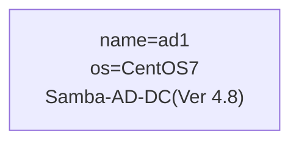
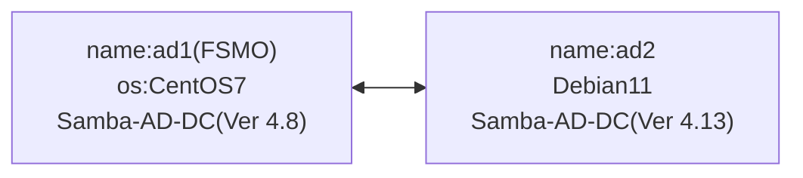
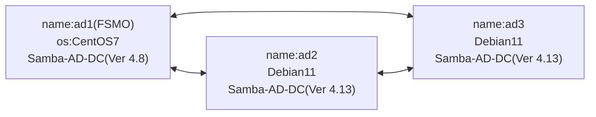
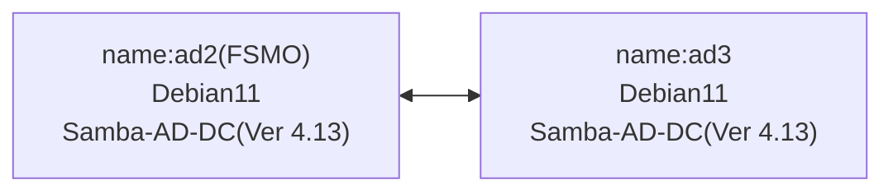

## はじめに

セカンドセレクションの前野です。本職はC#開発者ですが、片手間に社内インフラの面倒も見ています。

Samba-AD-DCのサーバーを2台使って、社内のActive Directroy環境を構築する流れを書いています。

あわせて、構築時に知りたかった用語を一緒に書きました。

あくまで、構築の流れしか書いていませんので詳細については各自で調べてください。

後、解釈や理解が追い付かず間違っているところがあったらコメントで教えていただけるとありがたいです。


## Samba-AD-DCとは

Samba-AD-DCは、オープンソースのソフトウェアで、WindowsベースのActive Directory（AD）ドメインコントローラと互換性のある機能を提供することを目的としています。
Samba-AD-DC:Samba Active Directory Domain Controller。

Samba-AD-DCは、LinuxやUNIXベースのシステムを含むさまざまなプラットフォームで実行できます。

Samba-AD-DCは、以下の主な機能を提供します。

1. Active Directory互換性: WindowsのActive Directoryと互換性があり、Windowsクライアントや他のActive Directoryリソースと連携できます。
これにより、LinuxやUNIXサーバーがWindowsベースのネットワークに統合され、シングルサインオン、ユーザー認証、アクセス制御などのActive Directory機能を利用できます。

2. ドメインコントローラ機能: 
    - ドメイン内のユーザーアカウント、コンピュータアカウント、ポリシー、セキュリティグループなどの管理するドメインコントローラとして機能します。
    - これにより、ユーザーとリソースの管理を中央集権化し、セキュリティと管理を向上させることができます。
    - ドメインコントローラ:Domain Controller,DC

3. LDAPサーバー: 
    - LDAPサーバーを提供し、ディレクトリサービスの要件を満たします。これは、ユーザー情報や認証情報などを保存および検索するために使用されます。
    - LDAP:Lightweight Directory Access Protocol

4. DNSサーバー: 
    - Active Directoryに関連するDNSサービスも提供します。これにより、ドメイン内のリソースの名前解決が可能になり、正確なドメイン構造が維持されます。
    - DNS:Domain Name System

Samba-AD-DCは、特に中小企業や教育機関などで、Windows環境とLinux/UNIX環境の統合を必要とする場合に役立ちます。  
これを使用することで、異なるプラットフォーム間での協調作業やセキュリティ管理が容易になり、コスト削減にも寄与します。


## 用語の説明

ADにおけるDCを構築を理解するにはFSMOサーバー、マルチマスタサーバーという用語が出てきますので、先に説明しておきます。

### マルチマスタサーバー

ADというのはマスタ／スレーブ方式で、マスタに登録するとスレーブに反映するものだと思っていたのですが、ADはマルチマスタサーバー方式で、各々が相互複製(レプリケーション)するものでした。

とは言えどっかのDCでパスワードが変更された時、レプリケーションができるまでAD全体にパスワードの変更が配信されないなんて不便なんで、FSMOサーバーというのがいます。
登録や変更が発生した時のレプリケーションの優先順位が高いDCのことです。


### FSMOサーバー

マルチマスタサーバーからわかるようにDC間に皆同じ情報を持つことになるのですが、AD内に１台だけFSMOサーバーとして特別な機能を持つサーバーが設定されます。FSMOサーバーについて何か特別なことをする必要はなく、Samba-AD-DC内で勝手にFSMOサーバーの処理をやってくれます。

DCをADから降格するときFSMOサーバーをどこか別のDCへ移動する必要があります。

FSMOについては下記のサイトを参考にしました。

https://blogs.manageengine.jp/about_fsmo/

### フォレスト

複数ドメインを束ねてフォレストといいます。
うちではドメインは1個しかないので、関係ありません。

### ActiveDirectoryデータベースとSYSVOLフォルダ

ADには情報を管理するために、ActiveDirectoryデータベースとSYSVOLフォルダがあります。

- ActiveDirectoryデータベース(ADデータベース)
  - ADデータベースは、ドメインのユーザーやグループ、コンピューターアカウントなど、ドメインの管理に必要な各種オブジェクトの情報が管理されています。
  - DC間で自動レプリケーションします。
- SYSVOLフォルダ
  - グループポリシーと呼ばれる、ドメインに参加している各コンピューター端末にシステム設定を配布する設定情報に関するデータが管理されている場所です。
  - DC間でレプリケーションしてくれないので、１日１回rsyncでad2からad3へSYSVOLフォルダをコピーしています。


## 構築ヒストリ

### 初期

2019年：CentOS7 Samba-AD-DC(Ver 4.8)１台　名称：ad1。



CentOS7にsamba4.8という布陣で始まりました。実はこのあたりの記録は、PCのHDDが飛んだせいで何も残っていません。
なんらかの形でクラウドに残して置くべきでした。今でも悔やんでいます。

どうやってインストールしたのかも分かりませんが、いくつのサイトを参考になんとか構築出来ました。今だったら構築の参考になるサイトが結構あるので苦労しないです。

そんなこんなで構築したADにユーザーやグループを登録して、NASではADで認証するように設定して運用できるようにしていきました。

### 二期

2022年8月：２台目のAD追加。



平穏な日々が続きました。特にメンテもせずに運用していました。
さてそろそろad1のSamba-AD-DCのバージョンをあげようとyum updateをかけたらアプリのリポジトリが更新されないという事態に陥りました。
Samba-AD-DCをインストールした時のリポジトリが終了したみたいで、何とかしようと思ったのですがインストール時の資料がなくお手上げ状態となりました。

仕方がないのでバックアップの２台目を追加することで、ad1が壊れても対応できる形にしてみました。

#### DCをADに参加するコマンド

ad2をADへ参加するコマンドは`samba-tool domain join`です。使い方はhelpやテックブログを見てください。

#### レプリケーションを確認するコマンド

DCがADに参加できたかどうかは、`samba-tool drs showrepl`を実行すると、どのDC間で情報のレプリケーションしているかが見られます。

successfulとステータスが表示されていればいいのですが、errorとなっていたら設定が悪いのか、ネットワークが悪いのかなどを確認します。


### 三期(現在)

2023年：3台目を追加して、初号機を終了させた。

#### 途中



2022年の12月に会社が引越ししたときに、どうもad1とad2の電源の落とし方が悪かったのせいなのか、ad1上でレプリケーションのエラーが出るようになりました。

Microsoftの「Active Directoryユーザーとコンピューター」でユーザの登録なんかができなくなりました。

こりゃいかんと急遽ad3を構築してADにjoinさせ、ad1を降格しようとしました。

ここで怖かったのはDC(ad1)の降格するとどうなるのかがわからず３日ぐらい悩みました。

悩んでばかりもいられないので、えーーい気合いと根性だと、ad1を降格してみたら特に問題なくad2とad3でレプリケーションするようになりました。


#### 現在



快適に動いてくれています。「Active Directoryユーザーとコンピューター」でユーザー登録もできるようになりました。

### ADのFSMOサーバーを設定する

ADの中でDCをFSMOサーバーに設定するコマンドは`samba-tool fsmo`です。FSMOサーバーにするDC上で`samba-tool fsmo`を実行します。
FSMOのDCをADから降格するならば、FSMOを別のDCに移動する必要があります。

この図ではad2上で`samba-tool fsmo`を実行しました。

### DCの降格

ADよりDCを降格するコマンドは`samba-tool domain demote`です。

降格という言葉でなかなかわかりにくいですが、要はDC間のレプリケーションからDCを抜いちゃういうことです。

ad1上でad1の`samba-tool domain demote`を実行したらエラーになったので、ad2上でad1を降格するコマンドを実行しました。

```
samba-tool domain demote --remove-other-dead-server=ad1
```

抜けちゃったad1を再度ADへ追加するには`samba-tool domain join`すれば良いみたいです。


## samba-tool(一般的なメンテナンス)

ユーザーやグループなんかは、Microsoftの「Active Directoryユーザーとコンピューター」でメンテナンスしますが、下記のコマンドでもできます。

大量のユーザーを登録する場合なんかは、下記のコマンドでスクリプトファイルを作って一気に実行するのもありです。

### samba-tool user

ユーザーを追加したり、変更したり、削除します。

### samba-tool group

グループを追加したり、変更したり、削除します。


## samba-tool(DNSのメンテナンス)

### samba-tool dns

社内のファイルサーバーやGitLabをドメイン名で登録します。


## SYSVOLフォルダのコピー

SYSVOLフォルダは、Samba-AD-DCではレプリケーションをしてくれないので、自前でやる必要があります。

### レプリケーションスクリプト

```
#!/bin/bash -eEu

echo '--- start ---'
date

on_error() {
    echo "[Err] ${BASH_SOURCE[1]}:${BASH_LINENO} - '${BASH_COMMAND}' failed">&2
}
trap on_error ERR
/usr/bin/rsync -XAavz --chmod=775 --delete-after  --progress --stats /var/lib/samba/sysvol root@ad3:/var/lib/samba/

/usr/bin/ssh 'root@ad3' /usr/bin/samba-tool ntacl sysvolreset
/usr/bin/ssh 'root@ad3' /usr/bin/samba-tool ntacl sysvolcheck

echo '--- end ---'

```


### レプリケーションのタイミング

一日１回下記のコマンドを実行して、レプリケーションをしています。一日１回というタイミングはいいのか、悪いのかはわかりません。

グループポリシーを変更したときだけレプリケーションをしてあげればいいのではないかと思ってはいるものの、いつ実施したらいいよという文献は見つかりませんでした。

ですので、一日１回やっておけばいいだろうと思ってやっています。


### どこでレプリケーションスクリプトを実行する

ad2上でrsyncを使ってad3へコピーします。

コピー後にad3上でパーミッションの整合性を修正する`samba-tool ntacl sysvolreset`を実行しています。


## これからどうする

- メインのad2が壊れたらad3に自動フェイルオーバーと言う形で接続しにいくという話なのですが、試した方がいいんでしょうね。

- Dockerコンテナを作って構築を楽にしたい。今の環境をコンテナ化して動くかどうかを試してみようかと考えています。

  

## 最後に

こんなことをやってADを構築しましたというのをサラッと書きました。とりあえず運用できていますので、問題ないはずです。

あくまでも、ローカルネットワーク上のことですので、ご留意ください。

スクリプトなんかの実行は自己責任でお願いします。
